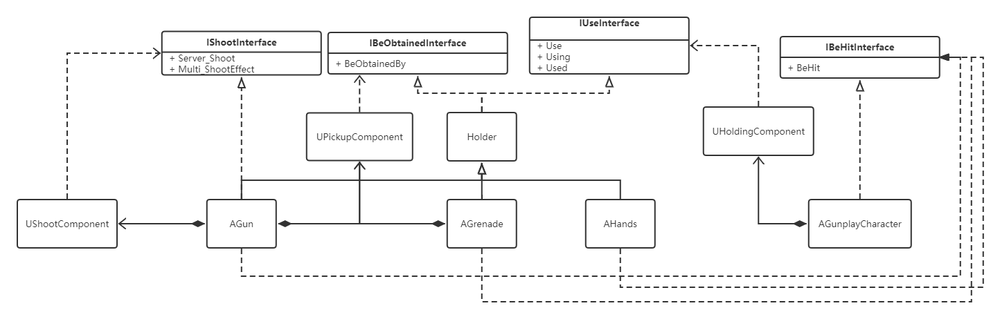
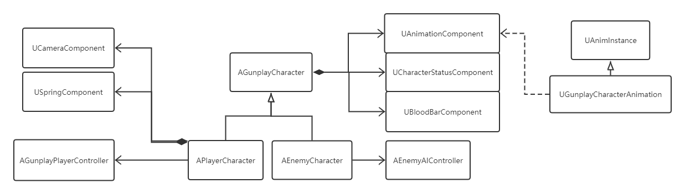

# Gunplay

> 使用UE4.27开发 
>
> 代码总行数为10608
>
> 打包文件位于“打包文件”目录下

## 基本要求
1. 安装 UE4.27，导入一个工程，进行简单编辑，编译完成并能形成安装包，确保能够用来将游戏工程安装到手机上进行运行；
2. 实现如下用户体验目标：玩家进入游戏后，来到一个靶场 - 靶场中有若干个靶子- 玩家可以拿起武器，朝向靶子射击 - 能够打到靶子；两位玩家可以通过联机在靶场中进行对战；
3. 实现基本游戏操作界面：如开火、显示玩家个人信息、单局积分展示界面；
> 实现了如下界面：
> 1. 玩家排名（多人游戏排名）
> 2. 角色属性（HP、速度、攻击、防御）
> 3. 持有武器（显示持有武器的名称、子弹数）
> 4. 准星（射击时准星会变大，会随机在准星范围内选择射击点）
> 5. 倒计时（积分模式）
> 6. 登录界面：单人模式、LAN联机（查找房间）、DS联机、设置玩家名称
> 7. 房间界面:（准备、开始游戏、切换地图、重置角色颜色）
4. 实现开火击中靶子的判定，以及靶子被击飞的物理效果；
5. 实现手雷的投掷，以及爆炸的范围击飞效果；
6. 给主角加入若干动作：站立不动、跑动、跳跃、开火等动作；
7. 给主角用枪做个特别材质（要求见资源包详细说明）， 并在枪上装个手电筒（Spotlight并开启阴影）；加入景深效果 ； ——含材质素材
8. 网络支持上，支持本机DS多玩家对战(局域网联机)；
9. 添加AI敌人，可实现：寻敌、移动、开火；

## 选做加分
1. 实现按下界面上的一个按钮，角色可以八方向移动和上下左右开火
> 拖动屏幕上的摇杆即可进行八分向移动，按下一个键后，玩家可以上下左右瞄准，此时准星变小，射击会更加精准
2. 实现敌人的 AI 类型（个性）不同，如：有些敌人会硬刚，有些敌人会在打不过的时候逃跑或躲避等。

> 实现了如下AI：
> 1. GunEnemy（硬刚）：总是与玩家保持一定距离，间隔一定时间开枪射击玩家。
> 2. SlyEnemy（狡猾）：会寻找较近的掩体，每隔一定时间从掩体出来打黑枪。
> 3. SneakEnemy（偷袭）：隐身，但是能够被手电筒投射出影子，只有被攻击时会现形，试图绕到玩家背后，攻击时会短暂现形。
> 4. SmartEnemy（战术）：一开始硬刚，近身攻击玩家，血量较低的时候会迅速逃跑，并不时回头开枪射击，逃跑时会寻找掩体，在掩体下持续回血，并从掩体下投掷手雷攻击玩家，血量到达一定量后会继续硬刚。
> 
## 额外实现的功能
1. 准星：在准星范围内随机射出子弹，射击会扩大准星，准星会自动回缩。可以设置启用准星吸附，此时准星靠近角色或靶子时会自动吸附上去。
2. 伤害数字：射击角色时，射击部位会冒出数字，表示单次射击造成的伤害
## 个人设计
游戏分为单人模式和多人模式。
多人模式的联机方式包含：
1. 借助局域网联机：房主既是client又是server
2. 借助DS联机，可以在本地启动DS，也可以直接连接服务器上的DS。

## 单人模式
### 极限生存
玩法：
1. 尽可能存活更长时间。
2. 玩家只有一条命。
3. 地图中有若干生成点，包括：
   1. 武器生成点，间隔一定时间生成武器。
   2. 靶子生成点，间隔一定时间生成靶子，靶子的形式是各种玩偶。
4. 击中各种靶子能够获取不同效果。包括：
   1. 生命恢复
   2. 攻击提升
   3. 速度提升
   4. 防御提升
   5. 获取随机武器
5. 每活过一波，玩家就会获得50点最大生命值提升。

6. 随着波数的增加，敌人的数量会增加，同时有更大几率出现更强的敌人
7. 一次只能选择一种靶子，击中一个靶子后，其他类型的靶子会消失
## 多人模式
### 积分模式
玩法：
1. 每名玩家需要在规定时间内获取更多分数，根据分数进行排名。
2. 得分方式：击中靶子（+10分）、击杀玩家（+100分）。

机制：

1. 地图中有若干生成点，包括：
   1. 武器生成点
   2. 靶子生成点，靶子的形式是各种玩偶。
2. 击中各种靶子能够获取不同效果。包括：
   3. 生命恢复
   4. 攻击提升
   5. 速度提升
   6. 防御提升
   7. 获取随机武器

物品与角色的类图

角色之间的类图

## 技术细节
### 安卓端旋转操作优化

PC端和移动端输入的不一致会导致移动端的输入看起来有延迟。因为PC端可以一直移动鼠标，采用的是根据输入来增加旋转的方式，而移动端不能一直移动摇杆，摇杆移到最边上时，输入达到最大，如果采用增加旋转的方式就会一直旋转下去，看起来就像有延迟了。

应该采用直接设置旋转的方式才不会看起来有延迟，每次开始输入时都要先存一个基础旋转，再在这基础上计算出当前输入对应的旋转，进行设置。